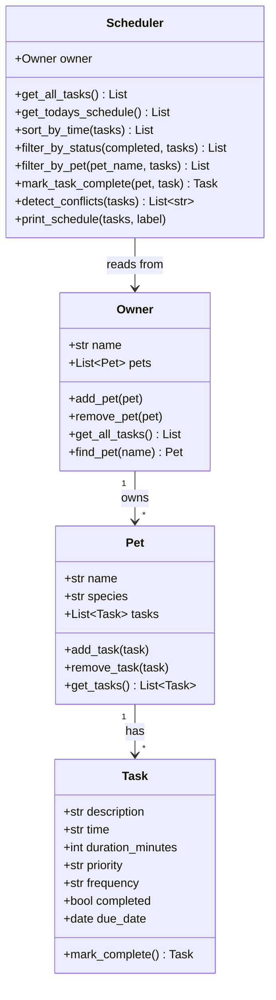

# PawPal+ Project Reflection

## 1. System Design

**Three core actions a user should be able to perform:**
1. **Add a pet** — register a new pet (name + species) under the owner's profile.
2. **Schedule a task** — create a care activity (description, time, duration, priority, frequency) for a specific pet.
3. **See today's tasks** — view all tasks due today, sorted chronologically, with conflict warnings highlighted.

**a. Initial design**

The initial UML contained four classes with clearly separated responsibilities:

| Class | Responsibility |
|---|---|
| `Task` | Represents a single care activity. Holds description, time, duration, priority, frequency, completion status, and due date. |
| `Pet` | Aggregates tasks for one pet. Provides add/remove/get operations on its task list. |
| `Owner` | Aggregates multiple pets. Provides a single `get_all_tasks()` that flattens all pet tasks into `(Pet, Task)` pairs. |
| `Scheduler` | The "brain." Wraps an Owner and adds sorting, filtering, recurrence handling, and conflict detection — keeping algorithmic logic out of the data classes. |



**b. Design changes**

One change made during implementation: `Task` was promoted from a plain class to a Python **dataclass**. Initially I considered a regular class with `__init__`, but using `@dataclass` with `field(default_factory=date.today)` for `due_date` removed boilerplate and made the Task immutable-by-convention while still allowing field mutation (e.g. `task.completed = True`).

A second change was adding `Owner.find_pet(name)` — not in the original UML — because the Streamlit UI needed to look up a specific Pet object by the name selected from a dropdown, and delegating that search to Owner kept the UI code clean.

---

## 2. Scheduling Logic and Tradeoffs

**a. Constraints and priorities**

The scheduler considers:
- **Time** — tasks are sorted by their `HH:MM` time string so the owner sees the day in chronological order.
- **Completion status** — completed tasks are excluded from today's view so the list stays actionable.
- **Due date** — `get_todays_schedule()` only surfaces tasks whose `due_date` equals today, preventing future tasks from cluttering the current view.
- **Frequency** — daily and weekly tasks auto-generate the next occurrence when marked complete, so recurring care never falls through the cracks.
- **Priority** — stored on the Task and visible in the UI table; the user can see at a glance which tasks matter most.

I decided time and completion status mattered most because those two directly answer the owner's core question: "What do I need to do right now?"

**b. Tradeoffs**

*Exact-time conflict detection vs. overlap detection.*

The conflict checker flags two tasks only when they share the **exact same HH:MM string**. It does not consider task duration, so a 30-minute walk starting at 09:00 and a 5-minute feeding starting at 09:15 are not flagged as overlapping.

This tradeoff is reasonable for a first version because:
- Most pet care tasks are discrete events (feed, medicate, walk), not continuous blocks.
- Overlap detection requires interval arithmetic (`start + duration > next_start`), which adds complexity without much real-world benefit — a pet owner can mentally handle a 15-minute gap.
- Exact-time matches are the most confusing edge case to discover at schedule-view time, and that is what the system catches.

---

## 3. AI Collaboration

**a. How you used AI**

AI (Claude Code) was used throughout:
- **Design brainstorming** — generating and reviewing the Mermaid UML diagram before writing a single line of code.
- **Skeleton generation** — converting UML attributes and methods into Python dataclass and class stubs.
- **Implementation guidance** — asking how `Scheduler` should retrieve data from `Owner` (answer: `owner.get_all_tasks()` returning typed tuples).
- **Algorithm review** — asking for a "Pythonic" way to sort `Task` objects by a string time field (using `sorted(..., key=lambda pair: pair[1].time)`).
- **Test generation** — drafting the initial test functions for mark_complete, add_task, sorting, recurrence, and conflict detection.
- **UI wiring** — explaining `st.session_state` as a persistent dictionary and how to gate object creation with an `if "owner" not in st.session_state` guard.

The most effective prompt pattern was: *"Given #file:pawpal_system.py, how should X interact with Y?"* — concrete file references produced accurate, directly usable code.

**b. Judgment and verification**

When AI suggested making `Scheduler.detect_conflicts` raise an `Exception` on conflict (halting the program), I rejected that in favour of returning a `List[str]` of warning messages. The reasoning: a scheduling conflict is a user input problem, not a bug — crashing the app would be a worse user experience than surfacing a warning in the UI. I verified the change by writing the `test_detect_conflicts_finds_same_time` test to confirm the method returns a non-empty list rather than raising.

---

## 4. Testing and Verification

**a. What you tested**

19 tests across four test classes:
- **TestTask** — `mark_complete` flips the flag; one-time tasks return `None`; daily/weekly tasks return the correct next `due_date`.
- **TestPet** — `add_task` and `remove_task` change the list length as expected.
- **TestOwner** — `get_all_tasks` aggregates across all pets; `find_pet` returns the right object or `None`.
- **TestScheduler** — chronological sorting; status and pet-name filtering; `mark_task_complete` auto-adds the next occurrence; conflict detection flags duplicates and ignores distinct times; edge case of a pet with zero tasks; today's schedule excludes completed items.

These tests are important because they cover both the "happy path" (normal inputs produce correct outputs) and edge cases (empty pet, same-time conflicts, one-time vs. recurring branching).

**b. Confidence**

★★★★☆ (4/5)

The 19 green tests give high confidence in the core logic. What I would test next:
- A pet with 100+ tasks (performance / sorting stability).
- Tasks across multiple days to confirm `get_todays_schedule` never leaks future tasks.
- The Streamlit UI itself using `streamlit.testing` utilities.
- The case where `due_date` is `None` (defensive validation at the API boundary).

---

## 5. Reflection

**a. What went well**

The clean separation of concerns worked very well. Because `Scheduler` is a pure logic layer that receives an `Owner` at construction time, testing it required no mocking — just real objects. The Streamlit UI remained thin because all decisions lived in `pawpal_system.py`, making the UI essentially a display layer that called scheduler methods and rendered the results.

**b. What you would improve**

With another iteration I would:
- Replace the exact-time conflict check with a proper interval-overlap check using `start + duration > next_start`.
- Add a `priority_sort` option to the Scheduler so the owner can toggle between "time order" and "most important first."
- Persist data between sessions using a SQLite file or JSON export so the schedule survives a browser refresh.

**c. Key takeaway**

The most important lesson: **AI accelerates implementation, but the architect must own the contracts.** Every class relationship, every method signature, and every test was a decision I had to consciously make and verify. When I let AI generate code without specifying the expected return type (e.g., should `detect_conflicts` raise or return?), I got a design I didn't want. Asking precise questions with explicit constraints produced useful answers. AI is a powerful pair-programmer, but it does not know what the user experience should feel like — that judgment belongs to the developer.

---

## Smarter Scheduling (Phase 4 Features)

- **Sorting by time** — `Scheduler.sort_by_time()` uses Python's `sorted()` with a `lambda` key on the `HH:MM` string, giving O(n log n) chronological ordering.
- **Filtering** — `filter_by_status()` and `filter_by_pet()` accept an optional task list so they compose: you can filter Mochi's pending tasks in one chain.
- **Recurring tasks** — `Task.mark_complete()` returns the next `Task` automatically; `Scheduler.mark_task_complete()` appends it to the pet, so the owner never manually reschedules daily or weekly care.
- **Conflict detection** — `Scheduler.detect_conflicts()` returns a list of human-readable warning strings for any two tasks sharing the same `HH:MM` slot. It returns warnings rather than raising exceptions, keeping the app stable while still alerting the owner.

---

## Testing PawPal+

Run the full test suite with:

```bash
python -m pytest
```

The suite (`tests/test_pawpal.py`) covers:
- Task completion status changes
- Recurrence: daily tasks create next-day occurrences, weekly tasks create next-week occurrences
- Task addition increases pet task count
- Chronological sorting correctness
- Filtering by pet name and completion status
- Conflict detection (same-time flagged; different times pass cleanly)
- Edge case: pet with zero tasks
- Today's schedule excludes completed tasks

**Confidence level: ★★★★☆** — all 19 tests pass; remaining gaps are UI-layer and long-term persistence tests.
